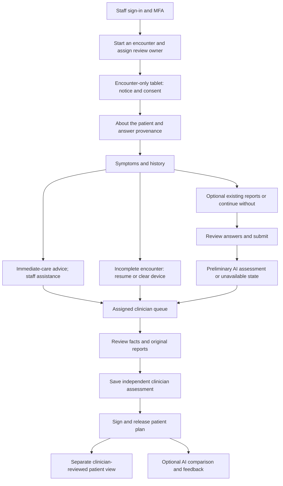

# UI reference

Implementation update, 22 September: the wireframe redesign and its verified states are
recorded in [configuration and verification notes](ai-providers.md). Regular product screens
use clinical workflow wording; fixture provenance is retained in records and test artifacts.

The owner supplied 19 PNG mockups in `docs/ui wireframes` on 15 September 2026 and
asked that implementation use them as its visual reference. Keep the original files intact.
These are design examples, not implemented capabilities or approved clinical content.

Use the spacious desktop layouts, navy text, teal accents, light bordered panels,
clear AI authorship and primary actions. Adapt the layout at tablet/phone widths rather
than shrinking the desktop canvas. Inputs need visible labels, keyboard focus, readable errors
and working actions. Hide language/account-help affordances until their destinations exist.

| Change | Reference screens |
| --- | --- |
| foundation | 7 Doctor Login 1/2 and Logout; visual shell from 8 Doctor Patient Queue |
| encounters and consent | 1 Consent, 2 Personal Information, incomplete intake |
| questionnaire and urgency | 3 Questionnaire, 4 Immediate Help Needed |
| report ingestion | 3A Upload Reports, 9A Review Reports with Evidence |
| patient assessment/output | 5 patient scenarios, 5A Disease Details and Evidence, AI unavailable, 6 post-review |
| clinician review and telemetry | 8 queue, 9 assessment, 10 completion/feedback, 11 comparison |

Implementation adjustments:

- Retain a single accessible six-digit authenticator input with paste/autofill support;
  separate visual boxes must not make entry harder.
- No fake queue counts, inactive clinical controls, invented staff acknowledgments or
  patient-facing claims that a clinician has reviewed a case.
- Clinical examples and illustrations remain DRAFT; reference artwork is not a clinically
  approved question instrument or licensed patient-reference image library.
- Replace wording such as “most likely possibilities” and “less common” in the assessment
  mockup with neutral possible causes and source facts. The agreed v1 contract prohibits
  numeric or graded likelihoods. Show missing evidence and unreviewed status clearly.
- Reports remain optional. Missing reports must not prevent intake or human review.
- Immediate-care screens advise seeking help/visiting a doctor or hospital. Do not add
  calling, SOS, automatic contact messaging or a requirement to finish intake first.
- Actual patient views require their own encounter-scoped session and reset; staff views
  must never be handed to patients on a shared tablet.

Foundation implements its staff/authentication scope only. Each later change should inspect
its applicable mockups before building, and record any material workflow deviation in its design.

## Screen-to-task contract — 21 September 2026

All 19 originals have been visually inspected. The following are delivery tasks to carry
into each owning OpenSpec change, not claims that these screens already exist. Screen numbers
refer to the filenames in `docs/ui wireframes`; repeated numbers represent distinct states.

| Reference file | Owning change | Required implementation and acceptance |
| --- | --- | --- |
| `1_Consent.png` | encounters-and-consent | Purpose/notice panel and unchecked visit consent; no clinical capture before consent. Record notice version, source of consent and assistance. Do not activate the optional “improve AI” purpose until its data use, retention and withdrawal are specified separately; refusing it must never block care. |
| `2_Patient_Personal Information.png` | encounters-and-consent | Separate who provides answers from who enters them; preserve patient/caregiver/staff provenance. Age/sex and language require explicit answers, unknown or declined, never clinical defaults. Hide read-aloud/language controls until supported; speech must not silently send text to an external service. |
| `3_Patient_Questionnaire.png` | questionnaire-engine + questionnaire-content-v1 | Tablet touch controls, desktop question/context panes, keyboard access, explicit unknown/declined, server-confirmed save state and stable stage progress. Body-map/text alternatives work without licensed images; no pre-ticked unanswered stages. |
| `3A_Patient_Upload Reports.png` | report-ingestion | Optional file/photo entry and an equally clear continue-without-reports action; upload progress, cancel, quality failure/retake and manual-review fallback. Camera access is limited to this flow. “Ready for verification” is distinct from clinically verified. |
| `4_Patient_Questionnaire Incomplete.png` | encounters-and-consent + questionnaire-engine | Resume only the authorised encounter; show answers saved only after server acknowledgment. Ending the device session clears the tablet but does not close the assigned encounter. Offline/failed-save wording must state what was not saved. |
| `4_Patient_Questionnaire Based Immediate Help Needed.png` | urgency-rules | Immediate advice interrupts intake independently of AI or uploads and persists on subsequent views. Show named staff acknowledgment only after it is recorded. Advise seeking assistance/visiting a doctor or hospital; no calling or dispatch controls. |
| `4_Patient_Questionnaire_AI Assessment Unavailable.png` | clinical-reasoning + output-generation | Honest failure/incomplete state, saved answers and actual review ownership; retain urgency advice, source access and device reset. Remove the mockup's “Illustrative reviewed state” label here: unavailable AI does not imply clinical review. |
| `5_Patient_AI Assessment_Non Urgent Disease Scenario.png` | clinical-reasoning + output-generation | Render possible causes, relevant source facts, missing evidence and next steps without reassurance or likelihood labels. The filename is not a triage rule: this example itself contains warning features and must use the actual matched urgency rules. |
| `5_Patient_AI Assessment_Serious Disease Scenario.png` | clinical-reasoning + output-generation | Prominent AI/unreviewed status, a possible serious cause with uncertainty and source links, appropriate review action. Adapt the headline to communicate suspicion rather than a confirmed cancer; no stage/resectability inference. Existing reports remain optional. |
| `5A_Patient_AI Assessment_Disease Details and Evidence.png` | output-generation | Accessible details panel/page showing supporting, conflicting and unknown facts with document/page or answer/version links. Neutral possible-cause ordering; no “most likely” or “less common” ranking. Show factual explanation, not hidden model reasoning. |
| `6_Patient_Post Doctor Review_mobile compatible.png` | output-generation + clinician-review | Distinct signed clinician plan with actual identity/time/version, instructions, follow-up and urgency. Original AI output remains labeled separately; corrected plans supersede rather than overwrite. Shared-tablet downloads need a delivery/cleanup design before enabling “Save”. |
| `7_Doctor_Login-1.png` | foundation | Spacious split desktop sign-in, stacked phone layout, email/password labels and generic error; working account-help guidance, no self-registration or inactive links. |
| `7_Doctor_Login-2.png` | foundation | Authenticator enrollment/challenge, single accessible six-digit field with paste/autofill, invalid-code recovery and keyboard operation on all three viewports. No QR/secret in logs or screenshots. |
| `7_Doctor_Logout.png` | foundation | Clear sign-out confirmation and sign-in-again action after acknowledged logout; pending remote revocation uses different copy. Protected content must clear in other tabs and on Back even if the confirmation page cannot load. |
| `8_Doctor_Patient Queue.png` | clinician-review (visual shell in foundation) | Live priority/status counts, explicit ownership and start-review action; show incomplete and AI-unavailable cases. Desktop table, compact tablet filters and phone cards with the same essential actions; merely opening a case must not announce review. |
| `9_Doctor_GI Surgeon Assessment.png` | clinician-review | Facts beside independent assessment, separate private notes and patient instructions, server autosave with conflict/error state. Save-independent-assessment, save-draft and sign/release are distinct transitions; AI is hidden until the independent assessment is persisted. Do not automatically prefill diagnostic conclusions. |
| `9A_Doctor_Review Reports with Evidence.png` | report-ingestion + clinician-review | Original report viewer with page/zoom controls beside extracted proposal; verify/correct/reject records actor, time and source. Never present OCR confidence as clinical certainty. Visible report date comes from the source, with conflicts flagged (the mockup's tab and report dates differ). No inference from raw CT/MRI pixels or DICOM viewer is implied. |
| `10_Doctor_Assessment Complete Optional AI Feedback.png` | clinician-review | Show saved/released only after atomic server confirmation of the signed snapshot; next-case navigation remains usable without optional feedback. Releasing a plan and closing a visit require explicit state semantics. |
| `11_Doctor_AI vs GI Surgeon Assessment Comparison.png` | clinician-review + pilot-telemetry | Compare immutable clinician and AI versions after independent assessment; internal coded feedback, including unable-to-assess, with no preselected favorable answer. Feedback cannot silently amend the patient plan. Record skipped feedback and prior AI exposure in evaluation denominators. |

## Connected flow to implement

This is navigation, not a sequential dependency for urgency or case assignment. Assign the
case from its first consented record; evaluate danger facts as they arrive, and allow reports
to be added/reviewed later. New facts invalidate stale assessment snapshots. A patient may
already have seen AI before the clinician's assessment: record that exposure rather than
calling every comparison blinded. Before consent, leaving shows generic advice with no
clinical answers stored. Patient “end session” and staff “sign out” are different operations.

For each owning change, add acceptance tasks for desktop 1440×900, tablet 1024×768 and phone
390×844, plus keyboard focus/order, readable error recovery, 200% zoom/reflow, sticky-footer
occlusion and long/empty content. Phone drawers must preserve focus and provide a return path;
desktop must retain useful side-by-side context. No screen is complete based on visual
similarity alone: its main, loading, empty, failed, expired and permission-denied paths must
work against the implemented state model.
